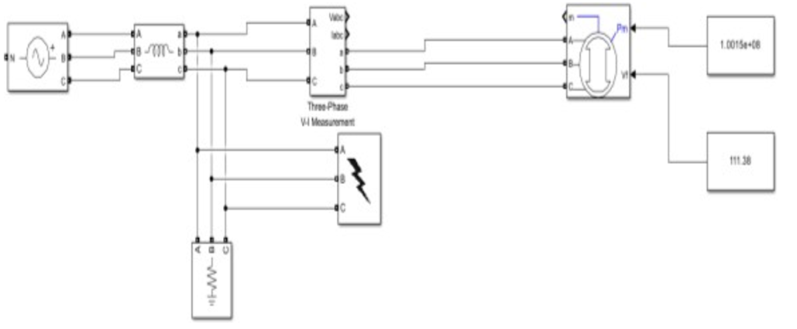
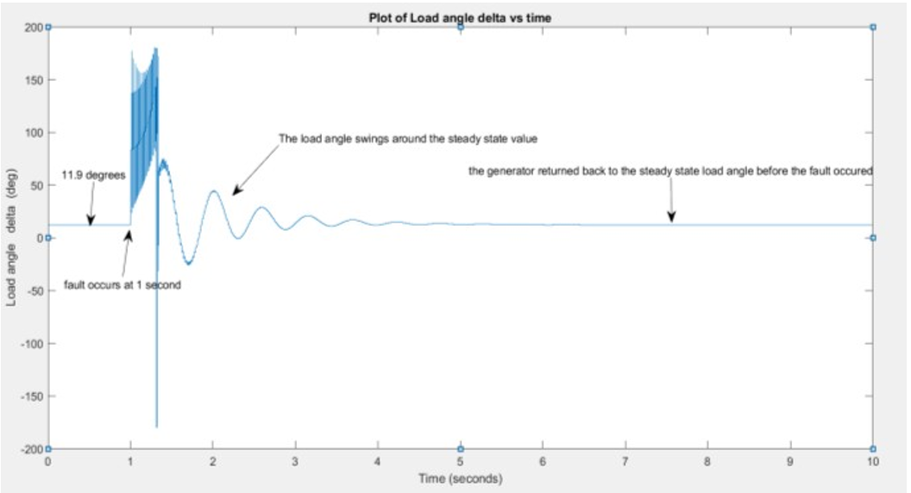
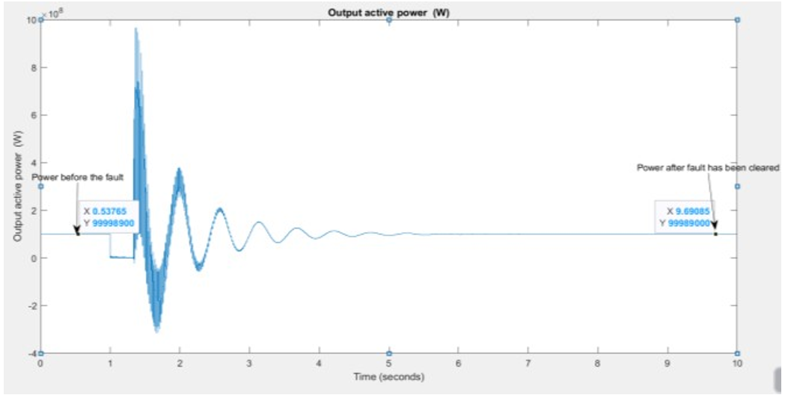
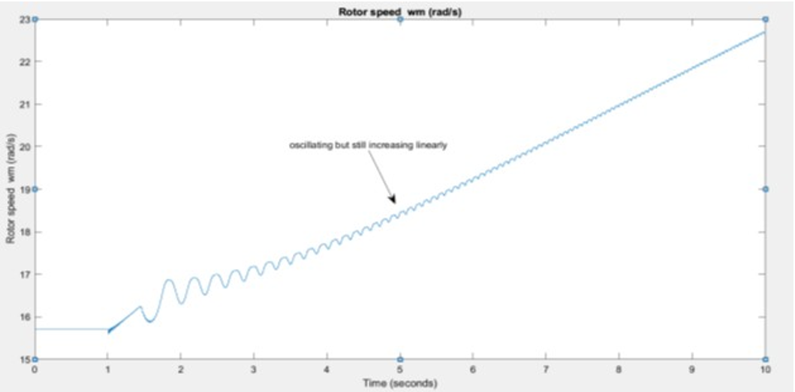
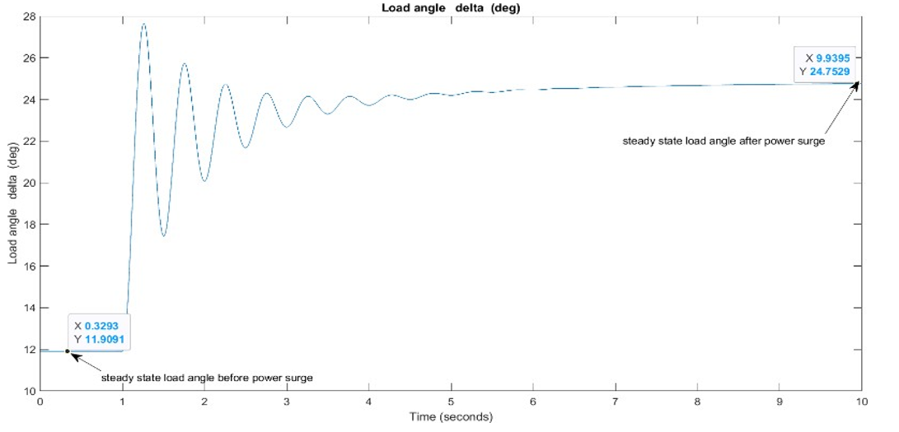
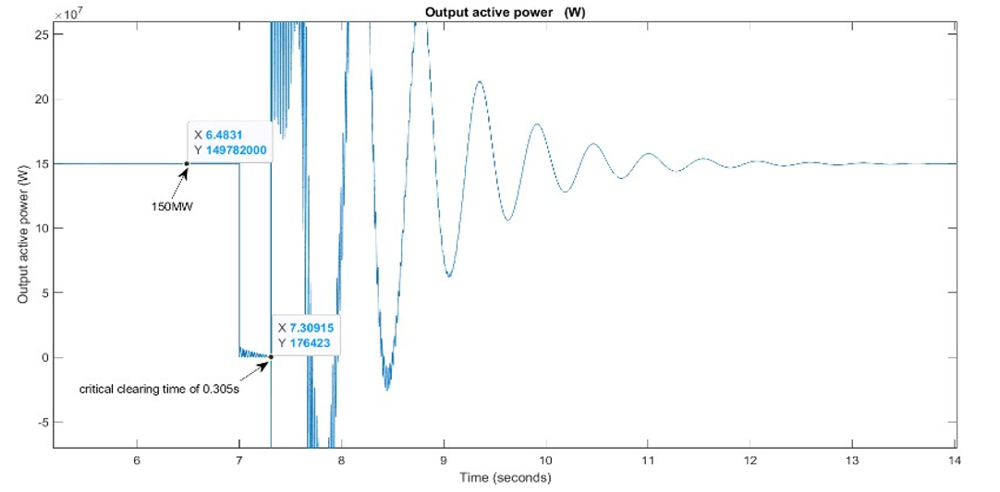
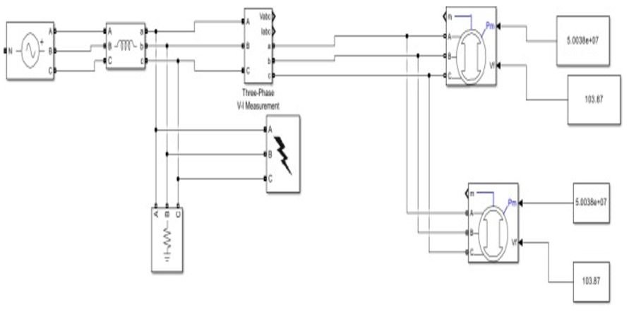
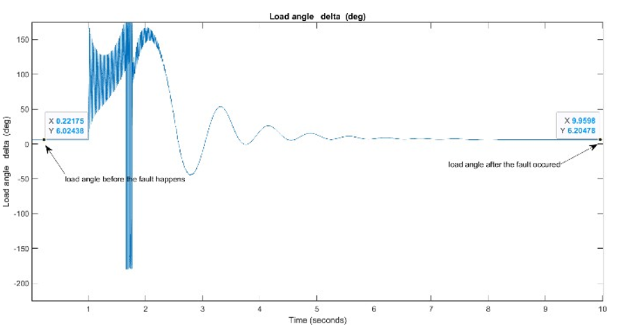

# Distributed Generation Impact on Power System Stability

## Overview
This project investigates the impact of Distributed Generation (DG) on power system transient stability. The study focuses on how DG integration affects critical clearing time (CCT), rotor dynamics, and overall system robustness under fault conditions.

---

## Objectives
- Analyze transient stability of a power system under faults  
- Evaluate the effect of DG penetration on system stability  
- Investigate changes in critical clearing time (CCT)  
- Study system response under load variations and disturbances  

---

## Base System Model

### Power System Network

Simulink model of the original power system without distributed generation.

---

## Fault Analysis and Stability

### Load Angle Response at Critical Clearing Time

Load angle oscillates during the fault and returns to its original steady-state value when the fault is cleared within the critical clearing time (0.438 s), indicating system stability.

---

### Electrical Power Response During Fault

Electrical power drops to zero during the fault and recovers to match mechanical power (100 MW) after fault clearance, confirming stable operation.

---

### Instability Beyond Critical Clearing Time

When the fault is cleared after the critical clearing time, rotor speed continuously increases, indicating system instability.

---

## Effect of Load Increase (Power Surge)

### Load Angle with Power Surge and Fault

After a power surge followed by a fault, the load angle settles at a different value, showing altered system equilibrium.

---

### Reduced Stability with Increased Load

With mechanical power increased to 150 MW:
- Critical clearing time reduces to 0.305 s  
- System becomes less stable  
- Load angle moves closer to instability limits  

---

## System with Distributed Generation

### Power System with DG Integration

Modified system including distributed generation sources.

---

### Improved Stability with DG

With DG integration:
- Critical clearing time increases to 0.759 s  
- System stability significantly improves  
- Voltage variations are reduced due to lower system impedance  

---

## Key Insights

- Increasing load demand reduces critical clearing time and system stability  
- Power surges push the system closer to instability (load angle → 90°)  
- Distributed generation improves stability by:
  - Increasing critical clearing time  
  - Reducing system impedance  
  - Enhancing fault tolerance  

- DG allows increased load capacity without compromising stability  

---

## Tools Used
- MATLAB  
- Simulink  

---

## Files
- Project_Report.pdf  
- Simulink_Model.slx  

---

## Conclusion
This project demonstrates that while increased load demand reduces system stability, the integration of distributed generation significantly enhances transient stability. DG improves critical clearing time, reduces system impedance, and enables higher load capacity without compromising system performance.

---

## Author
Royalty Holyworth Chihava
